[TOC]

**Solution Overview**
===============
WordPress is a free open-source content management system (CMS). It helps you quickly build personal forums, media libraries, member websites, learning management systems (LMSs), and online stores.

For details about this solution, visit https://www.huaweicloud.com/solution/implementations/build-a-personal-website-based-on-wordpress.html


**Architecture**
---------------
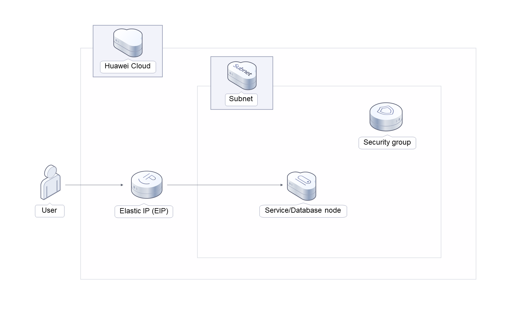

**Architecture Description**
---------------
This solution will:

1. Create an ECS, which will be used for running personal websites and database nodes.

2. Assign an elastic IP address (EIP) and bind it to the ECS to provide external website access.

3. Install WordPress and MySQL on the Linux ECS and complete related configurations.

4. Create a security group and configure security group access rules to ensure personal website security.

**File Structure**
---------------

``` lua
huaweicloud-solution-build-a-personal-website-based-on-wordpress
├── build-a-personal-website-based-on-wordpress.tf.json -- Resource orchestration template
├── userdata
    ├── install_wordpress.sh  -- Script configuration file
```
**Getting Started**
---------------
**(Optional) Changing the MySQL Database Password**

1. Log in to the [ECS console](https://console-intl.huaweicloud.com/console/?iscros=true&region=tr-west-1&locale=en-us#/home), locate the created ECS, and click  **Remote Login** to log in to the Linux ECS.

    Figure 1 Remote login

    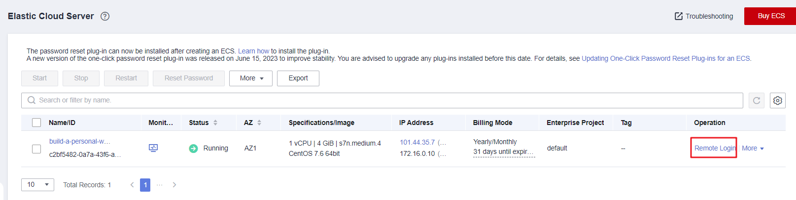

2. On the Linux ECS, enter the username and password and press **Enter**.

    Figure 2 Logging in to the ECS

    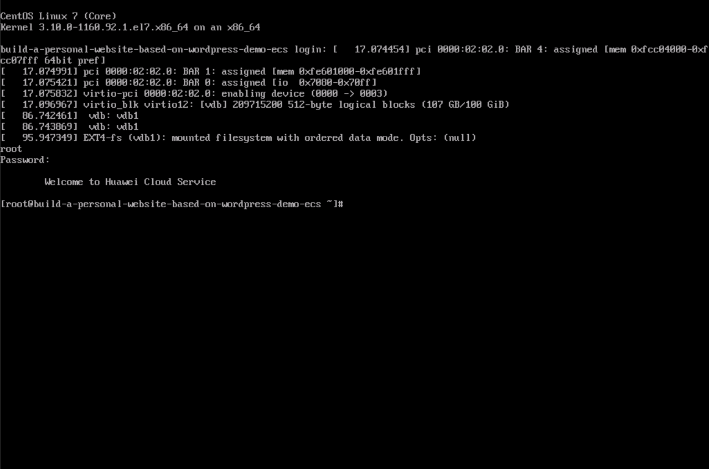

3. Run the **mysql -u root -p** command to log in to the MySQL database as user **root**. Then, press **Enter** and enter the password. Then run the **SET PASSWORD** command to change the password: **set password for root @localhost= password ('new password')**.

    Figure 3 Changing the password of the MySQL user **root**

    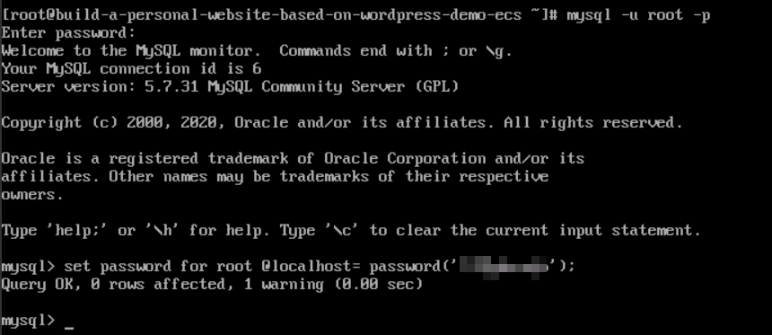

4. To change the password of the MySQL user **database**, log in to the MySQL database, enter **grant all on wordpress.* to wordpressuser@localhost identified by**** '**new password**';**, and press **Enter**. Then run the **exit** command to exit the MySQL database.

    Figure 4 Changing the password of the MySQL user **database**

    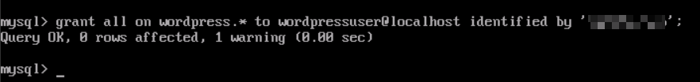

**Initializing WordPress**

1. Choose **Stack** > **Outputs** on the WordPress page, open Google Chrome, and enter the URL displayed after the deployment is successful. Then the WordPress installation wizard is displayed. On the console, select the **CN North-Beijing4** region.

    Figure 5 Output URL

    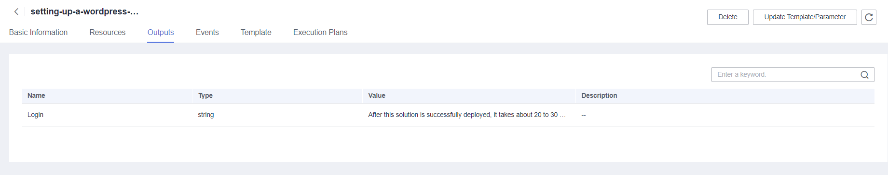

2. Configure the database as prompted and click **Let's go**.

    Figure 6 Installation wizard

    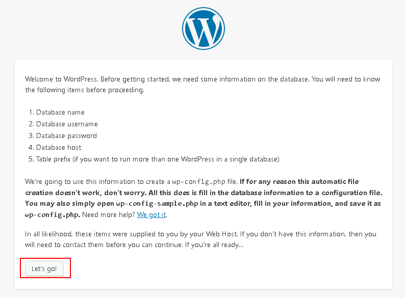

3. In the displayed dialog box, enter the database connection details, such as the username and password, and click **Submit**. The database verification is successful.

    Figure 7 Database connection details

    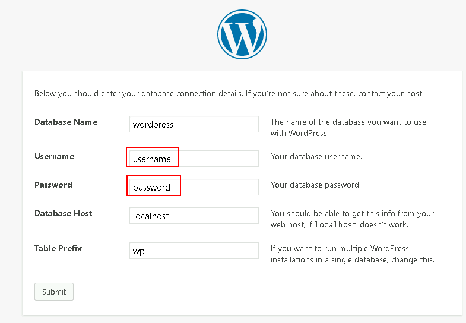
4. After the verification, the installation page is displayed. Click **Run the installation**.

    Figure 8 nstallation page

    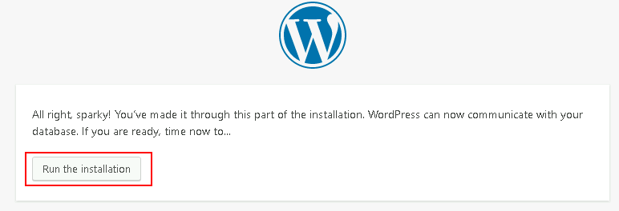

5. Set the site title, administrator username, password, and email address. Then, click **Install WordPress**.

    Figure 9 etting parameters

    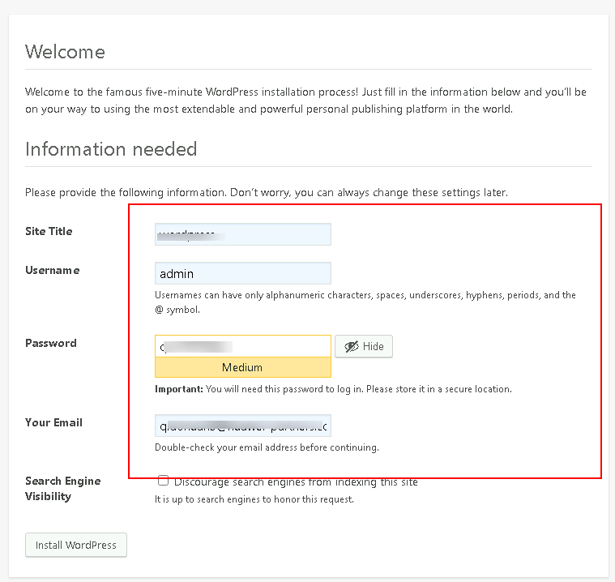

    Figure 10 Successful installation

    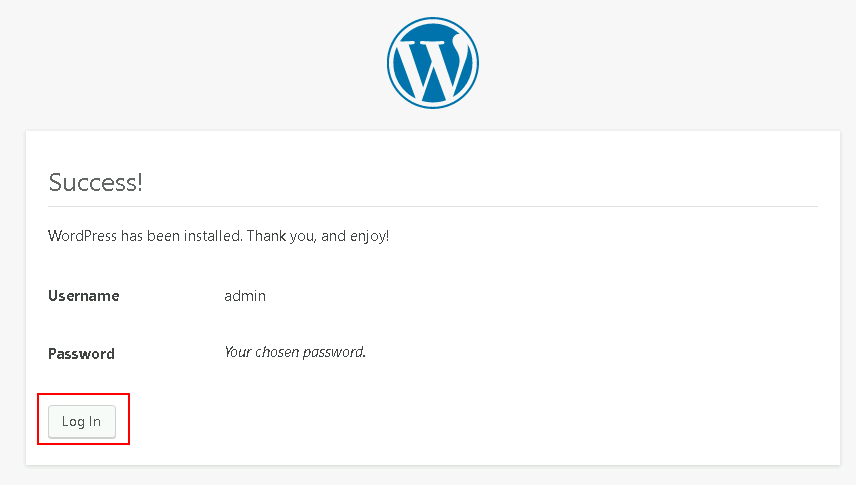

6. Click **Log In**. Alternatively, enter **http://***Server IP address***/wordpress/wp-admin** in the address bar of the browser, enter the username and password, and click **Log In**.

    Figure 11 WordPress login page

    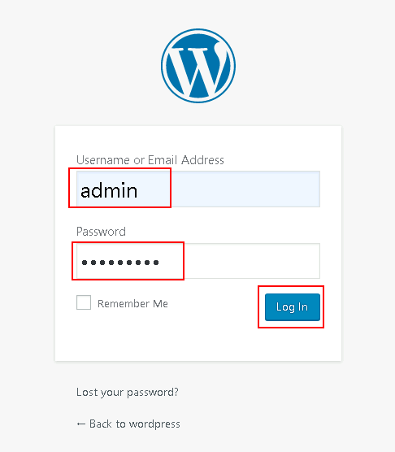

    Figure 12 WordPress page

    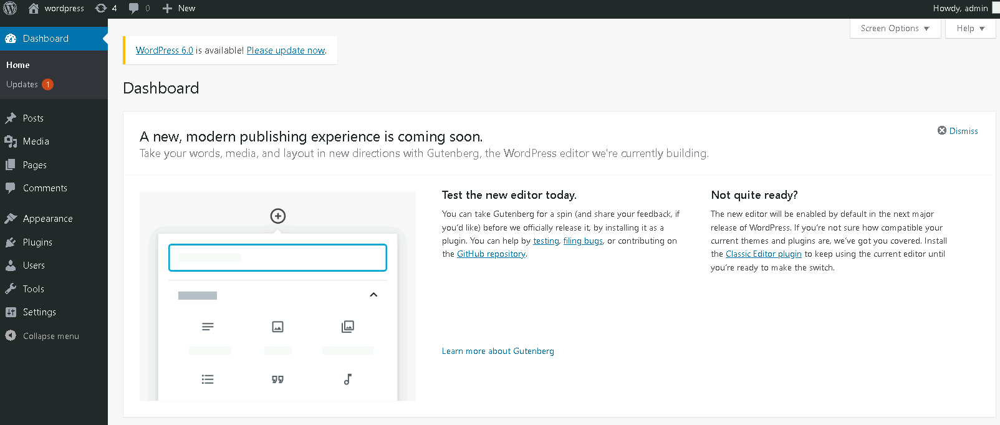


